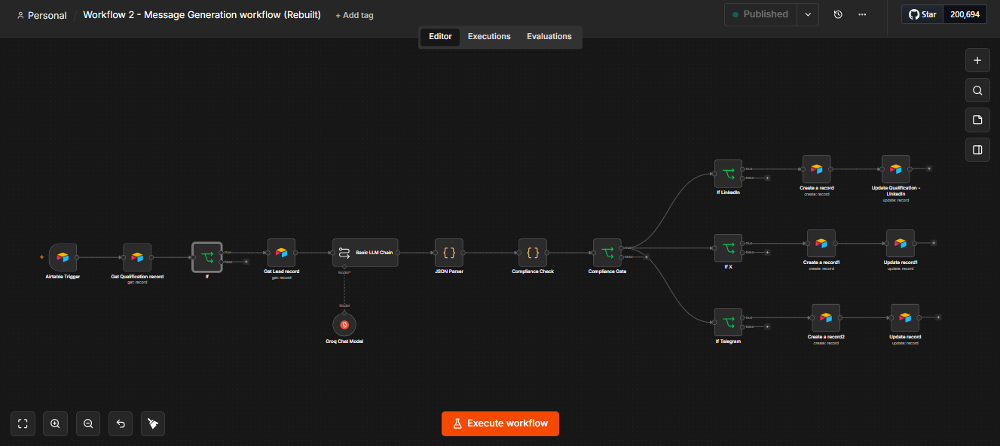

# Autonomous AI Outreach System

### AI-powered prospect qualification, message generation, validation, and outreach orchestration

**Built with:** n8n · Airtable · LLM APIs · REST APIs · Structured Outputs

---

## Overview

The Autonomous AI Outreach System is an AI-powered workflow designed to transform qualified prospect data into personalized, channel-specific outreach.

The system combines deterministic workflow logic with LLM-based reasoning to automate a multi-step process while maintaining lead context, validation, and processing state.

The goal is not simply to generate text with an LLM, but to build a **controlled AI pipeline** where model output is validated before downstream actions occur.

---

## Problem

Traditional outbound workflows often require sales teams to manually:

1. Review prospect information
2. Determine whether a lead is qualified
3. Research the prospect
4. Write personalized messaging
5. Adapt messaging to different channels
6. Update CRM records
7. Track whether the lead has been processed

This creates repetitive work and introduces inconsistency.

The system automates these steps while keeping structured data and workflow state at the center of the process.

---

## System Architecture

```text
                ┌─────────────────┐
                │   Lead Record   │
                └────────┬────────┘
                         ↓
                ┌─────────────────┐
                │ Qualification   │
                │      Gate       │
                └────────┬────────┘
                         ↓
                ┌─────────────────┐
                │ Context / Lead  │
                │    Retrieval    │
                └────────┬────────┘
                         ↓
                ┌─────────────────┐
                │   LLM Message   │
                │    Generation   │
                └────────┬────────┘
                         ↓
                ┌─────────────────┐
                │ Structured      │
                │ Output          │
                └────────┬────────┘
                         ↓
                ┌─────────────────┐
                │    Validation   │
                └────────┬────────┘
                         ↓
                ┌─────────────────┐
                │ Channel Routing │
                └────────┬────────┘
                         ↓
                ┌─────────────────┐
                │ Data Persistence│
                └────────┬────────┘
                         ↓
                ┌─────────────────┐
                │ Completion State│
                └─────────────────┘

### Actual Workflow


```

---

## Core Components

### 1. Qualification Gate

The workflow first determines whether a prospect should proceed through the AI generation pipeline.

This prevents unnecessary LLM calls and ensures that downstream processing only occurs for qualified records.

### 2. Context Retrieval

Relevant prospect information is retrieved before the model is called.

This gives the LLM structured context rather than relying on a generic prompt.

### 3. LLM Generation

The model generates personalized outreach based on:

* Prospect information
* Company context
* Qualification information
* Channel requirements
* Messaging constraints

### 4. Structured Output

Instead of relying on free-form model responses, the workflow expects structured output.

This makes downstream automation more predictable and easier to validate.

### 5. Validation

Generated output is checked before it reaches downstream systems.

Invalid or incomplete outputs can be stopped rather than automatically propagated.

### 6. Channel Routing

Validated messages are routed according to the required communication channel.

### 7. Persistence & State

Processing information is stored so that the workflow can track what has already been processed and maintain the state of each lead.

---

## Why This Architecture?

A key design principle was separating **AI reasoning from deterministic workflow execution**.

The LLM is responsible for tasks that benefit from language understanding and generation.

The workflow engine is responsible for:

* Routing
* Conditions
* State
* Validation
* Data updates
* API calls
* Execution control

This reduces the amount of critical business logic delegated directly to the model.

---

## Reliability Considerations

The system was designed with several reliability concerns in mind:

### Structured Outputs

LLM responses are expected to follow a defined structure rather than returning unrestricted text.

### Qualification Gating

Unqualified records are prevented from entering unnecessary processing stages.

### Validation

Generated output is checked before downstream execution.

### State Tracking

The system records processing state to reduce duplicate execution and improve traceability.

### Failure Isolation

A failure in one stage should not silently result in incorrect downstream data.

---

## Example Workflow

```text
Lead enters system
        ↓
Is lead qualified?
     ↙       ↘
   No         Yes
   ↓           ↓
Stop       Retrieve context
               ↓
          Generate message
               ↓
         Validate output
            ↙       ↘
         Invalid     Valid
           ↓           ↓
        Stop      Route message
                       ↓
                 Update record
                       ↓
                Mark complete
```

---

## Technical Challenges

Some of the main engineering challenges involved:

* Controlling LLM output
* Maintaining context across workflow stages
* Handling conditional execution
* Preventing invalid outputs from reaching downstream systems
* Managing workflow state
* Connecting multiple external services
* Designing automation that remains understandable and debuggable

---

## Future Improvements

Potential improvements include:

* Automated LLM evaluation
* Prompt versioning
* Retry strategies
* Observability and execution tracing
* Cost tracking per workflow execution
* Automated regression testing
* Human-in-the-loop approval
* More robust schema validation
* Queue-based execution for higher throughput

---

## What I Learned

This project reinforced an important principle in AI engineering:

> Reliable AI systems require more than a capable model.

The surrounding architecture—validation, state management, deterministic logic, observability, and failure handling—is equally important.

---

## Project Documentation

[Detailed project documentation](https://docs.google.com/document/d/1Bpl2MSHgduL5cA4ChKPdKrcakBZjd3221HWEwmqH-Ak/edit?usp=sharing)

---

## Author

**William Njoku**

AI Automation Engineer focused on building practical AI systems, agentic workflows, and intelligent automation.
